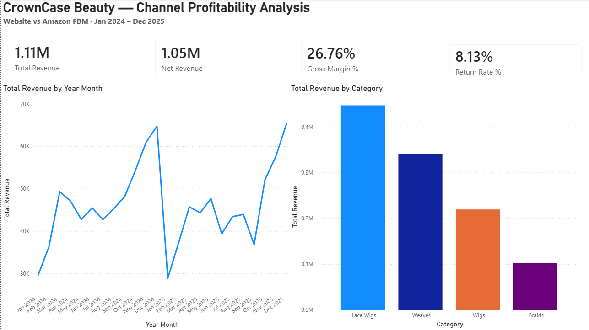
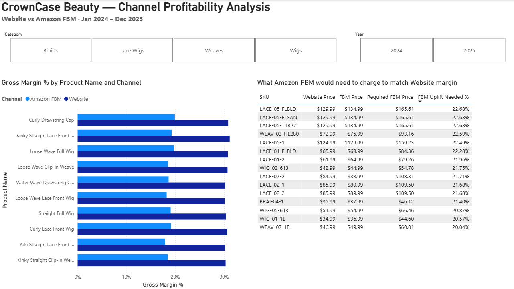
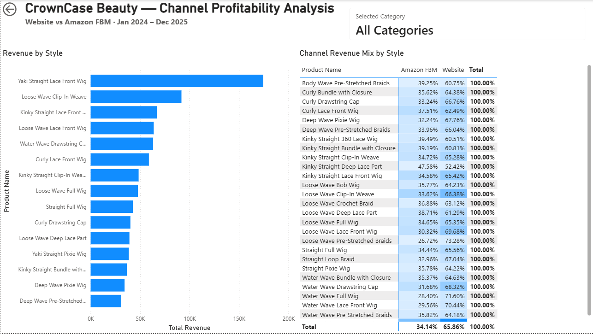

# CrownCase Beauty — Channel Profitability Analysis

As part of my current role, I manage multi-channel selling: same catalog but multiple different storefronts. The main challenge with managing different storefronts with different fees is constantly determining margins and sales performance. 

Because I am unable to use data I work with and I am unable to find public data that is similar, I built a simulated retailer dataset that behaves like the one I know. CrownCase Beauty sells hair and wig products through its own website and through Amazon FBM (Fulfilled by Merchant). This project takes it end to end - Python for generation and analysis, SQL Server for storage and querying, Power BI for the report.

The questions below are some of the questions I answer in my current role and this project's aim is to demonstrate how I answer them with different tools.

## The Questions

- For the exact same SKU, how much does channel choice change profitability?
- Which categories bring in the most revenue and are those the same ones bringing the most margin?
- Is seasonality one blended curve across the catalog or does each category have its own?
- When we run a 10% discount, what does that actually cost us in margin?
- Do return rates differ by channel, category or individual style?
- Are there styles that do much better in one channel?

## About the Data

The dataset is roughly 10000 orders spanning January 2024 - December 2025, across four categories: Wigs, Lace Wigs, Weaves and Braids.

I tried to make the data generated similar to the data I have encountered in real life - fees, discounts, seasonality were based on what I have observed, though not exactly the same. 

I also introduced data quality problems (null values, inconsistent capitalization, wrong date formats, duplicate rows) to simulate the cleaning stage especially when I export data from third party channels.

Shipping is in the data but stays out of every margin calculation. It's billed separately from the sale and the referral fee doesn't apply to it, so it passes straight through. Folding it into margin would count money that never affected the sale.

Since I wrote the generator, the broad structure in the data is structure I put there, and I'm not presenting these results as evidence about the real wig market. What the project demonstrates is the full path from messy source data to a decision-ready report.

## Tools Used

- **Python** (pandas, numpy) — data generation, cleaning, exploratory analysis, visuals
- **SQL Server** (T-SQL) — storage, a raw-to-clean view layer, queries behind the business questions
- **Power BI Desktop** — 3-page report (Executive Summary, Channel Comparison, Product Deep Dive) on a star schema with DAX measures

## Report Preview

**Executive Summary**


**Channel Comparison**


**Product Deep Dive**


If Power BI Desktop is not available, there's a PDF export at `powerbi/CrownCaseBeauty_Portfolio.pdf`. The data model and all 11 DAX measures are written up in `powerbi/measures.md`.

## Repo Structure

```
generate_products.py        builds the catalog, 170 SKUs across 4 categories
generate_channels.py        website and Amazon FBM fee/shipping reference
generate_orders.py          10,000 orders over 2 years, data quality problems injected

data/
  products.csv              generated catalog
  channels.csv              generated channel reference
  orders_clean.csv          cleaned export from the notebook, used in Power BI
                            (orders.csv is not committed, the script regenerates it)

sql/
  01_create_schema.sql      database and the 3 tables
  02_bulk_insert.sql        loads the CSVs
  03_cleaning_view.sql      orders_clean view, cleaning logic
  04_analytical_queries.sql 11 business queries

notebooks/
  phase3_analysis.ipynb     independent pandas clean, metrics, 6 charts, Power BI export

powerbi/
  CrownCaseBeauty_Portfolio.pbix   3-page report on a star schema
  CrownCaseBeauty_Portfolio.pdf    PDF export, for viewing without Power BI Desktop
  measures.md                      data model and all 11 DAX measures, written out

images/                     report screenshots used in this README

requirements.txt            pinned direct dependencies
```

## How to Run It

1. Clone the repo.
2. Create and activate a virtual environment, then install dependencies:
   ```
   python -m venv venv
   venv\Scripts\Activate.ps1
   python -m pip install -r requirements.txt
   ```
3. Generate the data (run in order):
   ```
   python generate_products.py
   python generate_channels.py
   python generate_orders.py
   ```
   This produces `data/products.csv`, `data/channels.csv`, and `data/orders.csv` (the last one intentionally messy — see below).
4. Set up SQL Server (requires a local SQL Server instance):
   - Run `sql/01_create_schema.sql` to create the database and tables.
   - Stage the 3 CSVs somewhere the SQL Server service account can read (a folder directly under `C:\`, in my case I used `C:\SQLData`).
   - Run `sql/02_bulk_insert.sql` to load the CSVs.
   - Run `sql/03_cleaning_view.sql` to build the `orders_clean` view.
   - Run `sql/04_analytical_queries.sql` for the 10 business queries.
5. Run `notebooks/phase3_analysis.ipynb` — connects to SQL Server independently, re-cleans the raw `orders` table in pandas, engineers `net_revenue`/`gross_margin_pct`, produces 6 visualizations, and exports `data/orders_clean.csv` for Power BI.
6. Open `powerbi/CrownCaseBeauty_Portfolio.pbix` in Power BI Desktop — a 3-page report (Executive Summary, Channel Comparison, Product Deep Dive).

## Key Findings

**What the analysis turned up:**

- **Amazon FBM can't be priced to match the website's margin.** The gap itself follows from how I built the pricing, but the size of the price move needed to close it doesn't. At a 15% referral fee, FBM would need to charge roughly 21% more than it does today to earn what the same SKU earns on the website. A $130 wig would have to list at $166. That holds across all 161 SKUs sold on both channels. The purpose of selling in FBM is to increase the number of buyers and not to match the website's margins. It should be managed with a margin floor, not a margin target. 
- **A 10% discount costs about 4.4 margin points, not 10.** Discounts are calculated from unit price while order size varies independently, so multi-unit orders dilute the hit. 

**Confirming the pipeline works:**

The rest isn't discovery so much as confirmation that the pipeline correctly recovered what I built into the generator. It doesn't say anything about the real wig market.

- Return rates sit around 8% across every channel, category and style. No real pattern anywhere. Expected, since return_flag was generated as a flat coin flip independent of all of those. This confirms the measurement is accurate, not that returns actually behave this way.
- Seasonality shows up as four separate curves, not one blended pattern. Wigs and lace wigs climb into November and December, weaves peak around February through April and braids run June through August. Both years hold the same shape. These curves were hand-designed into the generator.
- Units per order are flat across all four categories. Lace wigs' high AOV turns out to be pure price, not basket size. Units per order were generated independent of category, so this just confirms that independence held.
- The website out-margins Amazon FBM on every SKU sold through both channels, across 161 SKUs, zero exceptions. Given how pricing was built (FBM's premium is small, its 15% fee isn't), this gap is close to guaranteed by construction.
